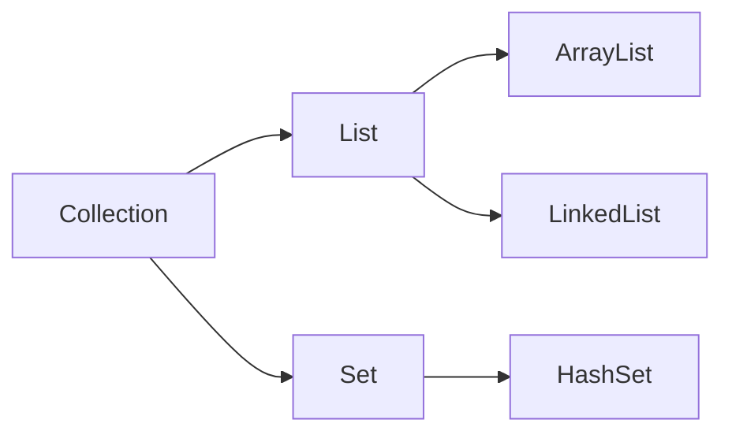

## 리스코프 치환 법칙
- Liskov Substitution Principle

```
서브 타입은 언제나 기반 타입으로 대체할 수 있어야 한다.
-> 자식 클래스는 부모 클래스로 대체 가능해야 한다.
```

- 대체가 가능하려면 부모와 자식이 일관성이 있어야한다는 뜻이다.

자바의 컬렉션 프레임워크(Collection Framework)가 좋은 예시다.



```java
void collectionTest() {
    Collection collection = new ArrayList<>();
    collection = new LinkedList();
    collection.add("a");
}
```
collection이 부모로써 다른 자식들을 대체할 수 있다.

### 위반한 경우

자식 클래스가 오버라이딩을 잘못하는 경우는 크게 두 가지로 나뉜다.  
- 첫번째는 자식 클래스가 부모 클래스의 메소드 시그니처를 자기 멋대로 변경하는 경우
- 두번째는 자식 클래스가 부모 클래스의 의도와 다르게 메소드를 오버라이딩하는 경우

#### 시그니처를 멋대로 변경하는 경우
```java
class Car {
    void go(int distance) {
        System.out.println("자동차가 " + distance + "km 이동합니다.");
    }
}

class ElectricCar extends Car {
    @Override
    void go(int distance, int speed) {
        System.out.println("전기차가 " + speed + "속도로" + distance + "km 이동합니다.");
    }
}
```
당연하게도 에러가 날 것이다.

#### 의도와 다르게 오버라이딩하는 경우

```java
class Car {
    String type;

    Car(String type) {
        this.type = type;
    }

    String getType() {
        return type;
    }
}

class ElectricCar extends Car {
    ElectricCar() {
        super("Electric");
    }

    @Override
    String getType() {
        return "This is an electric car";
    }
}
```
type을 반환하는 메소드인데 ElectricCar에서는 다른 값을 반환한다.


#### 잘못된 상속 관계로 구성으로 인한 메서드 정의

```java
abstract class Animal {
    void speak() {}
}

class Dog extends Animal {
    @Override
    void speak() {
        System.out.println("멍멍");
    }
}

class Cat extends Animal {
    @Override
    void speak() {
        System.out.println("야옹");
    }
}

class Fish extends Animal {
    @Override
    void speak() {
        throw new UnsupportedOperationException();
    }
}
```

Fish는 말을 할 수 없는데 speak 메소드를 오버라이딩하고 있다.
이럴 때는 Speak에 대한 인터페이스로 따로 빼는것이 적절하다.

```java
interface Speak {
    void speak();
}

class Dog extends Animal implements Speak {
    @Override
    public void speak() {
        System.out.println("멍멍");
    }
}
```

리스코프 치환 법칙은 다형성의 특징을 이용하기 위해 상위 클래스 타입으로 객체를 선언하여  
하위 클래스가 인스턴스를 받으면 부모의 메서드를 사용해도 동작을 의도대로 흘러가도록 구성하면 된다.

- 하지만 더 좋은 방법이 있다.
  - extends 대신 implements를 사용해 인터페이스로 구현하는 방법
  - 상속보다는 합성으로 구성

- 합성으로 구성했을 때 좋은 점
  - 상속은 부모 클래스의 변경이 자식 클래스에 영향을 미치지만 합성은 그렇지 않다.
  - 객체 관계를 동적으로 변경할 수 있다. (상속은 컴파일 시점, 합성은 런타임 시점에 결정)
  - 캡슐화가 잘 유지된다.

    
- 참고 문서
    - [문서](https://inpa.tistory.com/entry/OOP-%F0%9F%92%A0-%EC%95%84%EC%A3%BC-%EC%89%BD%EA%B2%8C-%EC%9D%B4%ED%95%B4%ED%95%98%EB%8A%94-LSP-%EB%A6%AC%EC%8A%A4%EC%BD%94%ED%94%84-%EC%B9%98%ED%99%98-%EC%9B%90%EC%B9%99)