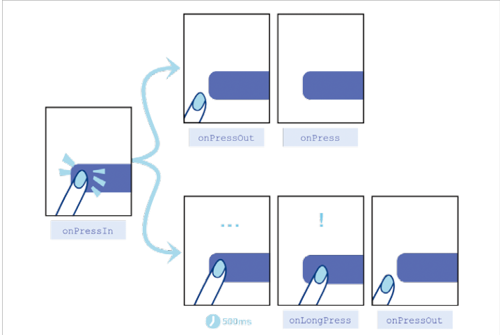

# button 클릭시 press 이벤트

## TouchableOpacity 컴포넌트에서 사용할 수있는 press 이벤트

1. onPressIn: 터치가 시작될 때 항상 호출
2. onPressOut: 터치가 해제 될때 항상 호출
3. onPress: 터치가 해제될때 onPressOut 이후에 호출
4. onLongPress: 터치가 일정 시간 이상 지속되면 호출

