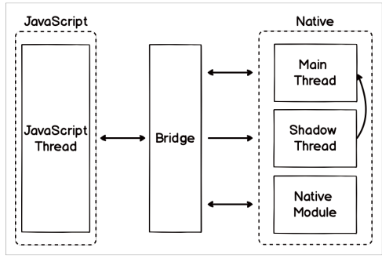

# 💻브릿지

## 브릿지가 필요한 이유

- 리액트 네이티브는 자바스크립트 코드를 이용해 네이티브 코드로 변경해준다.
- 그러려면 네이티브 계층과 통신할 수 있도록 해주어야 한다.
- 브릿지가 네이티브 계층과 통신할 수 있도록 해준다.

### 리액트 네이티브 브릿지

#### javascript
- 자바스크립트 스레드: 자바스크립트 코드가 실행되는 장소 (리액트 코드로 작성)
#### Native
- 메인 스레드: UI 담당
- 섀도 스레드: 레이아웃 계산하는데 사용 (백그라운드 스레드)
- 모듈: 자체 스레드 사용( 안드로이드 경우 스레드 폴 공유)